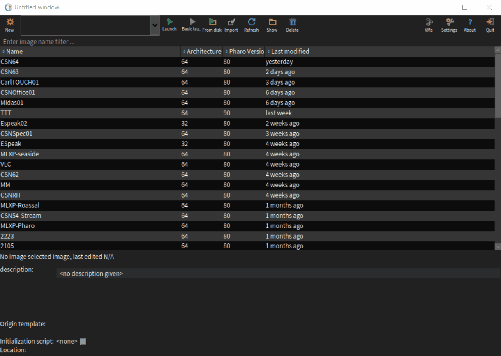
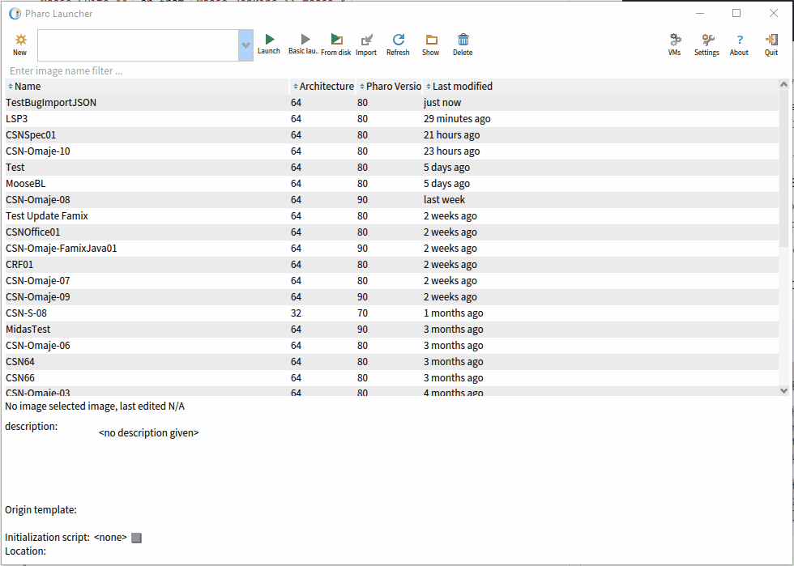

# Install Moose <!-- omit in toc -->

In this article, we describe how to install Moose.

- [Installation](#installation)
  - [Step 1 - Install Pharo Launcher](#step-1---install-pharo-launcher)
  - [Step 2 - Get Moose Image](#step-2---get-moose-image)
- [Add all GitHub releases in the launcher](#add-all-github-releases-in-the-launcher)

## Installation

1. Install Pharo Launcher
2. Get Moose Image

### Step 1 - Install Pharo Launcher

The easiest way to install Moose is to use the Pharo Launcher.
You can download it from the [Pharo website.](https://pharo.org/web/download)

### Step 2 - Get Moose Image



From the Pharo Launcher, you can download a Moose image.
It corresponds to a Pharo image (see the [pharo open documentation](https://github.com/pharo-open-documentation)) with the Moose tools installed.

To get a Moose you can either select one from `Official distributions >> Moose Suite XX` or from `Moose Jenkins >> moose-X`.

Once the image downloaded, you just need to run it with from the Pharo Launcher.

## Add all GitHub releases in the launcher

If you want to access all versions of Moose, instead of the most recent ones, you can use the GitHub releases. To do so, add this project into the pharo launcher:

- Download the PharoLauncher (see Step 1 of previous section)
- Open PharoLauncher
- Open a playground (Ctrl + O, Ctrl + W)
- Execute the following piece of code

```st
| sources |
sources := {
    PhLTemplateSource new
        type: #HttpListing;
        name: 'Moose';
        url: 'https://github.com/moosetechnology/Moose/releases';
        filterPattern: 'href="([^"]*/Pharo[0-9][^"]*.zip)"';
        templateNameFormat: '{6} ({5})' }.
PhLUserTemplateSources sourcesFile writeStreamDo: [ :s | 
    (STON writer on: s)
        newLine: String lf;
        prettyPrint: true;
        nextPut: sources ]
```

- Close the playground
- `New >> Moose >> Your version`


