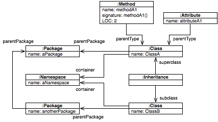

# Importing and exporting models

The first step in the process of analysis is the generation of a model of a given target system or set of data.
Moose can handle multiple types of data and data sources.
This chapter provides a short guide for how to deal with these.

## Importing and exporting with MSE

The preferred way to load a model in Moose is via an MSE file.
To load an MSE file, all you have to do is to press the _``Import from MSE''_ button in the Moose Panel and indicate the file to load.
This creates a model, populates it with the entities from the file and adds the model to the repository.
Visually, the model appears in the list of models from the Moose Panel.

Another way is to import the model from a playground by executing (in the case of a FamixJava model):

```st
FamixJavaModel importMSEFromStream: ('./path/to/string' asFileReference readStream).
```

But what exactly is MSE?
MSE is the default file format supported by Moose.
It is a generic file format and can describe any model.
It is similar to XML, the main difference being that instead of using verbose tags, it makes use of parentheses to denote the beginning and ending of an element.

The following snippet provides an example of a small model:

```mse
((FamixJava.Namespace (id: 1)
    (name 'aNamespace'))
  (FamixJava.Package (id: 201)
    (name 'aPackage'))
  (FamixJava.Package (id: 202)
    (name 'anotherPackage')
    (parentPackage (ref: 201)))
  (FamixJava.Class (id: 2)
    (name 'ClassA')
    (container (ref: 1))
    (parentPackage (ref: 201)))
  (FamixJava.Method
    (name 'methodA1')
    (signature 'methodA1()')
    (parentType (ref: 2))
    (LOC 2))
  (FamixJava.Attribute 
    (name 'attributeA1')
    (parentType (ref: 2)))
  (FamixJava.Class (id: 3)
    (name 'ClassB')
    (container (ref: 1))
    (parentPackage (ref: 202)))
  (FamixJava.Inheritance
    (subclass (ref: 3))
    (superclass (ref: 2))))
```

The file defines 8 entities: 1 Namespace, 2 Packages, 2 Classes, 1 Method, 1 Attribute and 1 Inheritance.
For each of these entities it provides a unique identifier (_e.g._, (id: 1)) and it defines properties.
In general, properties can be either primitive, like (name 'aNamespace'), or they can point to another entity, like in the case of (container (ref: 1)) which denotes that the container property of ClassA points to the instance of Namespace named aNamespace.

The overall object graph can be seen graphically below.



A more complex MSE example is available for download as described in .

Once a model is loaded, it can be easily exported as an MSE file.
This can be done via the contextual menu of the model.
By choosing the _``Export to MSE''_ menu item you will be prompted to indicate the desired file name and location, and the result is an MSE file saved on the disk containing the entities in the model.

It is also possible to do it programmatically by executing: 

```st
"will ask where to create the mse file"
model exportToMSE.

"will write the mse in mseFile.mse"
model exportToMSEStream: ('path/to/new/mseFile.mse' asFileReference writeStream).
```

## Importing Pharo code

Moose comes with a built-in importer for Pharo code. The prerequisite for using this importer is that you first need the target source code present in the Pharo image.

Once the code is present, simply press on the ``Load from Pharo'' item from the menu of the Moose Panel, and follow the steps from the opening wizard.

This importer works out of the box for code built for Pharo.
For code written in other Smalltalk dialects, the code must first be made loadable into Pharo.
Moose does not offer ready made solutions for these other languages, but for most known dialects, like VisualWorks, you can often find solutions for exporting the code in a file format loadable in Pharo.
An important note is that the code does not have to be fully functioning.
It merely needs to be loadable in the Pharo image.

## Create mse file for other language

To create mse files for other programming languages please refer to the [parser section](./../README.md#Parser).
