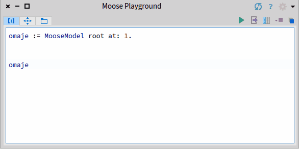
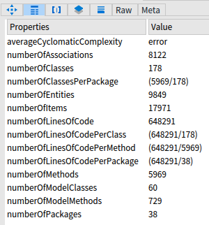
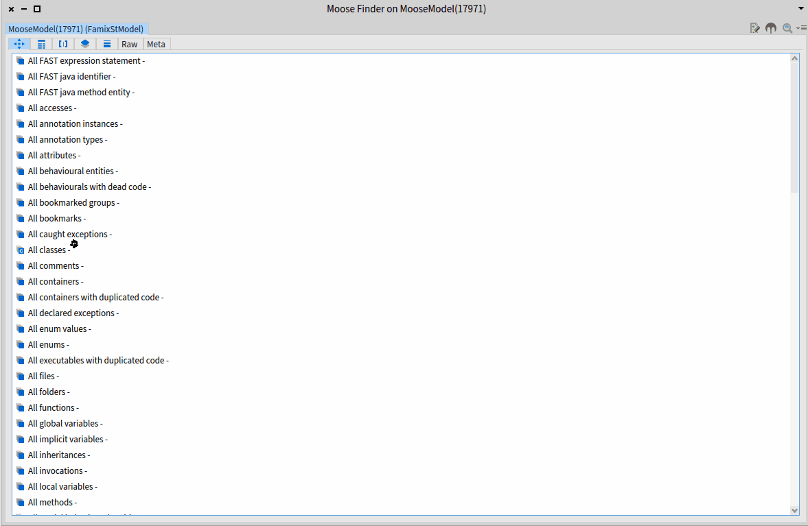
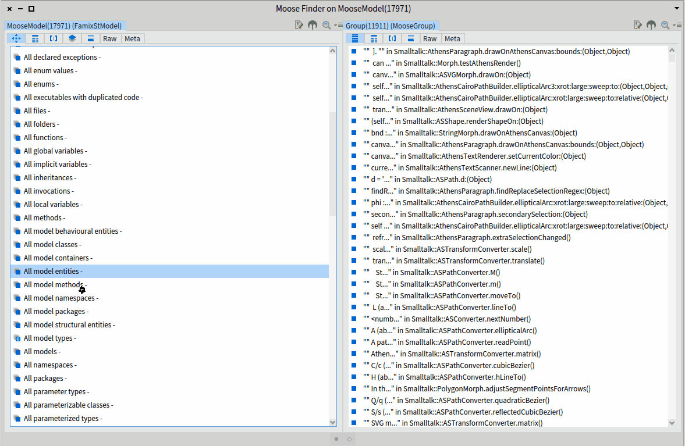

# Inspector <!-- omit in toc -->

Moose comes with a powerful tool to navigate the models: the Pharo inspector.
The Pharo inspector allows one to inspect an object: see its variables, and modify them.
The moose platform creates several plugins to enhance the Moose Users experience and provides information each software engineer required.

In the following, we will present the main features.

- [Browsing a model](#browsing-a-model)
  - [Accessing model properties](#accessing-model-properties)
  - [Navigating in the model](#navigating-in-the-model)
- [Inspecting an entity](#inspecting-an-entity)
- [Inspecting a specialized group](#inspecting-a-specialized-group)
- [Creating its plugins](#creating-its-plugins)

## Browsing a model

It is super easy to browse a model with the Moose Inspector.
From an open playground (or Moose Playground) execute `inspect` on the variable that contains the model.

Several actions are then available:

1. Accessing the main properties of the model
2. Visualizing the meta-model description
3. Executing a custom query on the model
4. Navigating in a category of entities declared in this model

### Accessing model properties

Model properties include the number of classes and methods that are interesting to determine the size of the project.

### Navigating in the model

When inspecting the model, the inspector shows us several categories that we can use to navigate inside the model.
To navigate, you only need to click on an item of the shown list.

> Items that begin with `All model` are concepts that have been imported in the model.
> In category such as `all classes`, we explore *normal* concepts and *stubs*

## Inspecting an entity

## Inspecting a specialized group

The inspector also offers several visualizations for the groups of concepts.
For instance, it is easy to visualize the hierarchy/system complexity of a group of class or its UML.

To do so, one needs:

1. navigate a group of classes
2. select the interesting classes *(optional)*
3. transform the moose group into a moose specialized group
4. use the moose extension

## Creating its plugins
