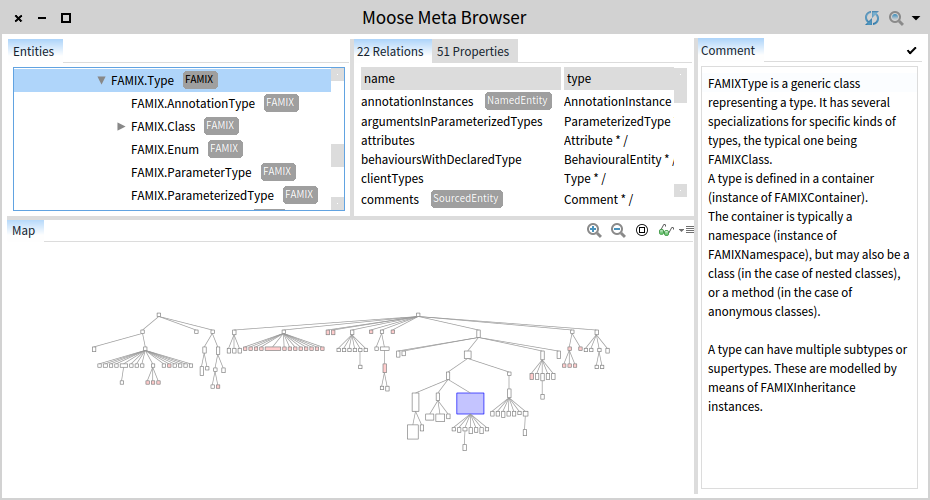

# Meta browser

We can create multiple meta-models thanks to Moose tools. To browse the landscape of an meta-model at any point in time, we have a dedicated browser that offers a logical view of the meta-descriptions.

The Meta Browser can be can be spawned from the Moose menu or by executing:

```st
"change MyMooseModel by the model you want to browse"
MyMooseModel browseMeta.

"for example with FamixJava"
FamixJavaMooseModel browseMeta.
```

The browser shows the hierarchy of classes to the top-left. Selecting an class shows both the references to other classes and the primitive properties. At the bottom, a map of the overall class hierarchies is provided as a Mondrian visualization. The current selection is shown on the map in red. Furthermore, the comment of the current selection is shown to the right.

The picture below shows the browser focused on the SourcedEntity and on the sourceAnchor property.


